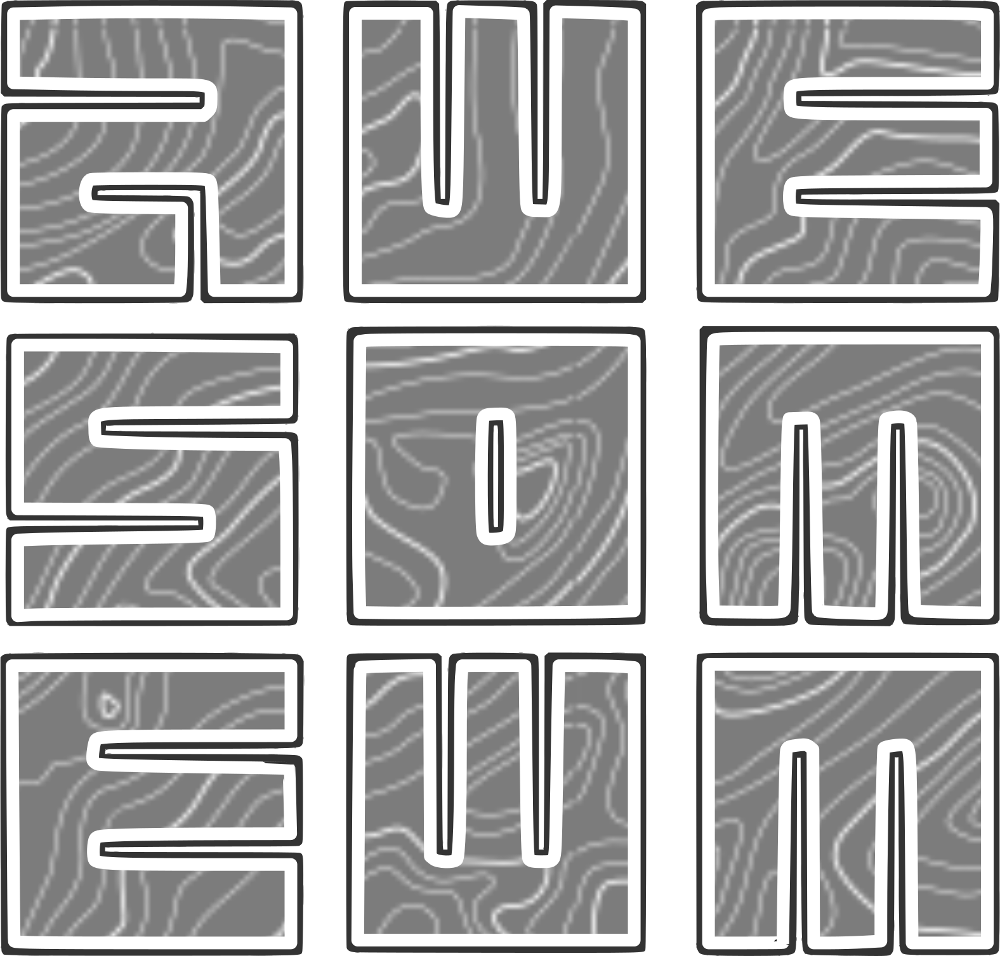

# AwesomeWM Configuration

A modern, feature-rich AwesomeWM configuration with custom UI components, animations, and comprehensive system integration.



---

## Highlights

- **13 hand-crafted tiling layouts** with a Mod4+F2 keyboard navigation overlay
- **13 system services** — audio, brightness, network, bluetooth, battery, system info, … — all as observable singletons
- **Hover-reveal wibar** with auto-hide, animated slide-in, 30s keyboard lock
- **D-Bus native** — no `awesome-extra` shell-out for NetworkManager / BlueZ / UPower
- **Live OSDs** for volume, brightness, and layout (animated progress arcs)
- **Picom-friendly** transparency and blur, with native Lua fallbacks
- **Typed overlay helpers** (`awful.util.dpi`, `awful.util.color_alpha`, `awful.util.config_path`, `awful.util.timed`) for cleaner config code
- **Pure-Lua test suite** — no X server required, runs in CI on every PR
- **Strict StyLua formatting** enforced by CI

## Features

- **Custom UI Components**: Modern control panels, popups, hotkeys help overlay, and notification system
- **Comprehensive Theming**: Kailash theme with Monokai Pro Spectrum palette, (pseudo-)3D button gradients, rounded corners, transparency and consistent styling
- **Advanced Window Management**: Custom taglist/tasklist, Alt+Tab window switcher, and client management with 13 custom layouts
- **System Integration**: Audio (PulseAudio/PipeWire), brightness, network (NetworkManager), Bluetooth (BlueZ), battery, and system info services
- **Popups & Overlays**: Control panel, application launcher, window switcher, power menu, screenshot selection, battery details, day info panel, and paginated hotkeys reference
- **Animations**: Smooth slide/fade transitions and visual feedback throughout the interface
- **Modular Architecture**: Well-organized codebase with clear separation of concerns and reusable UI module library

## Development

```bash
# Validate Lua syntax (no X server required)
awesome -c rc.lua --check

# Run the unit tests
lua tests/run.lua

# Format Lua code
stylua .

# Open a Xephyr test session with auto-reload
./bin/awmtt-ng.sh start -R
```

See [CONTRIBUTING.md](CONTRIBUTING.md) for code conventions, the singleton pattern, and how to add new layouts / services / popups.

## Installation

I use nix to handle the installation of awesomewm and the dependencies of this configuration and
nixpkgs has its own quirky naming conventions which I will leave it to you to translate in the
naming conventions used by your distro.

This configuration is compiled for awesomewm compiled with luajit, but should work as expected with awesomewm
compiled from the git repository (>4.3 aka `awesome-git` on the AUR).

A non-trivial portion of the visual effects are the result of picom (pijulius fork), which provides the
shadows and other compositor specific effects that I have been slowly replacing with native functionality
written in lua, but this process is a work in progress and not guaranteed to completely eliminate the need
for picom, especially for the blur effect between transparent surfaces and the wallpaper.

```
```

## Project Structure

```
├── configuration/          # Core AwesomeWM functionality
│   ├── autostart/          # Auto-start applications and error handling
│   ├── client/             # Client (window) management, rules, and signals
│   ├── keybind/            # Keybinding definitions (10 organized files)
│   ├── screen/             # Screen management and primary screen override
│   ├── tag/                # Tag (workspace) management with custom layouts
│   └── theme/              # Theme initialization
├── lib/                    # Utility libraries
│   ├── dbus_proxy/         # D-Bus communication layer
│   ├── inspect.lua         # Debug inspection utility
│   ├── json.lua            # JSON handling
│   └── surface_filters/    # C-based surface filtering (blur, etc.)
├── modules/                # Reusable UI modules
│   ├── animations/         # Animation framework (slide, fade, easing)
│   ├── applet_button/      # Reusable applet toggle/launcher button
│   ├── applet_pages/       # Page container with applet integration
│   ├── arc_chart/          # Arc chart widget for progress display
│   ├── backdrop/           # Semi-transparent overlay behind popups
│   ├── button_patterns/    # Standard button behavior patterns
│   ├── button_styles/      # Named button style definitions
│   ├── calendar/           # Instantiable calendar widget
│   ├── click_to_hide/      # Click-outside-to-dismiss popup behavior
│   ├── container_styles/   # Named container style definitions
│   ├── crop_surface/       # Surface cropping utilities
│   ├── dropdown/           # Dropdown selection widget
│   ├── hover_button/       # Button widget with hover effects
│   ├── icon-lookup/        # Icon theme lookup across system/custom paths
│   ├── layouts/            # 13 custom layout implementations
│   ├── menu/               # Context menu system
│   ├── page_container/     # Swipeable page container for multi-view popups
│   ├── remote_watch/       # Watch remote resources for changes
│   ├── shapes/             # Shape function library
│   ├── snap_edge/          # Window edge snapping with preview
│   ├── styled_button/      # Themed button combining styles and patterns
│   ├── text_input/         # Text input widget with cursor and selection
│   └── ui_constants/       # Shared UI dimension and color constants
├── service/                # System service integrations (directory per service)
│   ├── audio/              # PulseAudio/PipeWire volume control
│   ├── battery/            # Battery level and charging state
│   ├── bluetooth/          # Bluetooth management via BlueZ D-Bus
│   ├── brightness/         # Screen brightness via sysfs
│   ├── caps/               # Caps lock state detection
│   ├── garbage_collection/ # Periodic Lua GC to prevent memory leaks
│   ├── network/            # NetworkManager D-Bus integration
│   ├── screenshot/         # Screenshot capture utility
│   └── system_info/        # Kernel, uptime, CPU, memory info
├── themes/                 # Visual themes
│   └── kailash/            # Active theme — Monokai Pro Spectrum palette
├── ui/                     # User interface components
│   ├── bar/                # Hover-reveal top panel with module widgets
│   ├── lockscreen/         # Screen locker with PAM authentication and word clock
│   ├── notification/       # Notification daemon replacement (screenshot-aware)
│   ├── popups/             # Popup overlays
│   │   ├── battery/        # Battery detail popup
│   │   ├── control_panel/  # System controls (audio, brightness, WiFi, BT, notifications)
│   │   ├── day_info_panel/ # Day/date info popup
│   │   ├── hotkeys_popup/  # Paginated keyboard shortcut reference
│   │   ├── launcher/       # Application launcher with search
│   │   ├── menu/           # Right-click desktop menu
│   │   ├── on_screen_display/ # OSD for volume, brightness, layout
│   │   ├── powermenu/      # Power/logout/sleep/restart
│   │   ├── screenshot_popup/ # Screenshot mode selection
│   │   └── window_switcher/ # Alt+Tab client switcher with icons
│   ├── tabbar/             # Window tab bar
│   ├── titlebar/           # Window title bars with close/maximize buttons
│   └── wallpaper/          # Dynamic wallpaper management
├── upstream/               # Modified AwesomeWM builtin libraries (awful, beautiful, gears, etc.)
├── bin/                    # Shell scripts (awmtt-ng for Xephyr test sessions, showcase recorder)
└── tests/                  # Pure-Lua unit tests (run with `lua tests/run.lua`)
```

## Key Components

### Core Systems
- **Client Management**: Advanced window placement, rules, signals, resize helpers, and client restoration
- **Keybindings**: Comprehensive keyboard shortcuts organized into 10 categories (focus, hardware, launcher, layout, mouse, system, tags, window, etc.)
- **Tag Management**: Custom workspace handling with dynamic layout switching
- **Error Handling**: Robust error reporting with notification integration
- **Custom Layouts**: 13 hand-crafted layouts (cascade, centerwork, deck, equalarea, grid, map, mstab, navigator, stack, termfair, thrizen, and more)

### User Interface
- **Control Panel**: System settings with audio sliders, brightness, WiFi applet, Bluetooth applet, and notification center
- **Application Launcher**: Modern app launcher with search functionality and SVG icons
- **Window Switcher**: Alt+Tab style window navigation with client icon buttons
- **Hotkeys Popup**: Paginated keyboard shortcut reference with themed colors and backdrop
- **On-Screen Display**: Volume, brightness, and layout indicators
- **Power Menu**: System power management interface (power off, reboot, sleep, lock)
- **Screenshot Popup**: Quick mode selection (fullscreen, selection, delayed)
- **Battery Popup**: Detailed battery status with arc chart visualization
- **Day Info Panel**: Date and calendar information

### Services
- **Audio Service**: PulseAudio/PipeWire integration for volume and device management
- **Brightness Service**: Screen brightness control via sysfs with smooth transitions
- **Network Service**: NetworkManager D-Bus integration for WiFi and connection status
- **Bluetooth Service**: BlueZ D-Bus integration with rfkill-aware adapter management
- **Battery Service**: Power status and charging indicators with 15s polling
- **Screenshot Service**: Capture utility with fullscreen, selection, and delayed modes
- **Caps Lock Service**: Keyboard LED state detection
- **System Info Service**: Kernel, uptime, CPU, and memory information
- **Garbage Collection Service**: Periodic Lua memory management

### Theming
- **Kailash Theme**: Modern design based on Monokai Pro Spectrum palette with vibrant accent colors
- **Icon System**: Multi-source icon lookup across system icon themes and custom SVG sets (Colloid-Dark)
- **Typography**: Custom font stack with Nerd Font glyphs for text icons
- **Color Palette**: Consistent 8-char hex color scheme with alpha transparency across all components
- **Gradients**: Radial and linear gradient support for depth and visual flair

## Configuration

### Entry Point
The configuration loads via `rc.lua`, which:
1. Initializes luarocks (if available)
2. Adds the `upstream/` directory to `package.path` for modified builtin libraries
3. Adds `lib/` to `package.cpath` for native modules
4. Requires `configuration` (core functionality) and `ui` (interface components)

### Keybindings
See [documentation/keybindings.md](.documentation/keybindings.md) for the complete keybinding reference.

### Theme Customization
Modify `themes/kailash/theme.lua` to customize:
- Monokai Pro Spectrum colors and gradients
- Fonts and typography
- Border radius and spacing
- Icon theme paths
- Wallpaper image

### Adding Services
Create new services in the `service/` directory following the directory pattern:
```lua
local gobject = require("gears.object")
local gtable = require("gears.table")

local module = {}

local function new()
    local ret = gobject({})
    gtable.crush(ret, module, true)
    -- initialization
    return ret
end

local instance
local function get_default()
    if not instance then
        instance = new()
    end
    return instance
end

return { get_default = get_default }
```

## Development

### Testing

```bash
# Start test environment (Xephyr nested session)
./bin/awmtt-ng.sh start

# Stop test environment
./bin/awmtt-ng.sh stop

# Start with auto-reload
./bin/awmtt-ng.sh start -R

# Format code
stylua .

# Check configuration
awesome -c rc.lua --check
```

### Code Style

- **Indentation**: 4 spaces
- **Line width**: 80 characters max
- **Variables**: `snake_case`, always use `local`
- **Functions**: `snake_case` with clear parameter documentation
- **Comments**: Document purpose and parameters for complex functions
- **Quotes**: Prefer double quotes
- **Requires**: Grouped at top of files (standard → external → local)

### Adding Features

1. Follow the modular architecture — use existing modules and patterns
2. Create services as `service/[name]/init.lua` with `gobject` + `get_default()` singleton pattern
3. Create UI components as popup singletons with mutual-exclusion signal wiring
4. Maintain consistent theming and styling via `beautiful.*` theme variables
5. Add appropriate error handling with `pcall()` for potentially failing operations
6. Test in nested session before deployment

## Documentation

- [Keybindings Reference](.documentation/keybindings.md)
- [Additional Resources](.documentation/Additional-Resources.md)
- [Credits](.documentation/Credit-Where-It-Is-Due.md)
- [Icon Lookup Module](modules/icon-lookup/README.md)

## Contributing

1. Follow the existing code style and architecture
2. Test changes in the nested environment
3. Update documentation for new features
4. Ensure all functionality remains working

## License

This configuration is provided as-is for educational and personal use.
